# VISTA-AI Hybrid Multimodal Architecture

This document illustrates the hybrid, 3-tier ensemble architecture designed to detect bullying by analyzing both **how** something is said (acoustic tone) and **what** is being said (semantic meaning).

## System Architecture

The architecture relies on a "Late Fusion" ensemble approach. Models 1 and 2 operate completely independently on the same 15-second audio chunk, and Model 3 acts as the final meta-decision-maker.

```mermaid
graph TD
    A[Raw 15s Audio Chunk] --> B(Model 1: Acoustic Pipeline)
    A --> C(Model 2: NLP Pipeline)
    
    subgraph Model 1: Acoustic Analysis
    B --> B1[MFCC & Audio Feature Extraction]
    B1 --> B2[SVM Classifier]
    B2 --> B3{Audio Probability Score}
    end
    
    subgraph Model 2: Semantic Analysis
    C --> C1[Speech-to-Text / Whisper ASR]
    C1 --> C2[LLM / Text Classifier]
    C2 --> C3{Text Probability Score}
    end
    
    subgraph Model 3: Fusion & Weighting
    B3 --> D[Meta-Classifier / Weighted Mixer]
    C3 --> D
    D --> E((Final Binary Decision))
    end
    
    classDef modelBox fill:#1e1e1e,stroke:#3b82f6,stroke-width:2px;
    class B1,B2,C1,C2,D modelBox;
```

## Detailed Component Breakdown

### 🎙️ Model 1: Acoustic Emotion (The "How")
- **Input:** Raw `.wav` audio chunk.
- **Process:** Extracts physical audio features like MFCCs, Zero-Crossing Rate, and RMS Energy using `librosa`.
- **Algorithm:** Support Vector Machine (SVM).
- **Purpose:** Detects aggressive tones, raised voices, crying, or harsh impacts. It does not understand language, making it highly effective across different accents, languages, or when speech is muffled.
- **Output:** Confidence probability (e.g., `85% confidence of Bullying`).

### 📝 Model 2: Semantic NLP (The "What")
- **Input:** Raw `.wav` audio chunk.
- **Process:** 
  1. **Transcription:** Uses an Automatic Speech Recognition (ASR) model (like OpenAI's Whisper) to transcribe the audio into raw text.
  2. **Classification:** Feeds the transcribed text into an NLP model (e.g., BERT, RoBERTa, or a prompted LLM) to analyze the semantic meaning of the words.
- **Purpose:** Detects targeted harassment, psychological insults, or threats that might be spoken in a calm, quiet, or sarcastic tone (which Model 1's acoustic analysis would completely miss).
- **Output:** Confidence probability (e.g., `92% confidence of Bullying`).

### ⚖️ Model 3: The Fusion Mixer (The Decision)
- **Input:** The two independent probability scores from Model 1 and Model 2.
- **Process:** Acts as a Meta-Classifier to combine the modalities.
- **Implementation Options:**
  - **Static Weighting:** Hardcoding a ratio (e.g., `(0.7 * Model_1) + (0.3 * Model_2)`).
  - **Dynamic Weighting (Recommended):** Training a tiny, lightweight **Logistic Regression** model specifically on the outputs of Models 1 and 2. 
- **Purpose:** To build a robust system that can handle failure. If a video is extremely noisy (e.g., wind or static), Model 2's Speech-to-Text will fail and output garbage text. Model 3 can be trained to recognize this uncertainty and automatically shift its "weight" to rely entirely on Model 1's acoustic analysis for that specific video.

> [!TIP]
> **Why this specific architecture? (Late Fusion)**
> By keeping Model 1 and Model 2 completely separated until the very end, it allows your team to develop, test, and upgrade the Audio and Text models completely independently. If a better Speech-to-Text model comes out tomorrow, you can simply swap out Model 2 without having to rewrite or retrain your Acoustic SVM!
